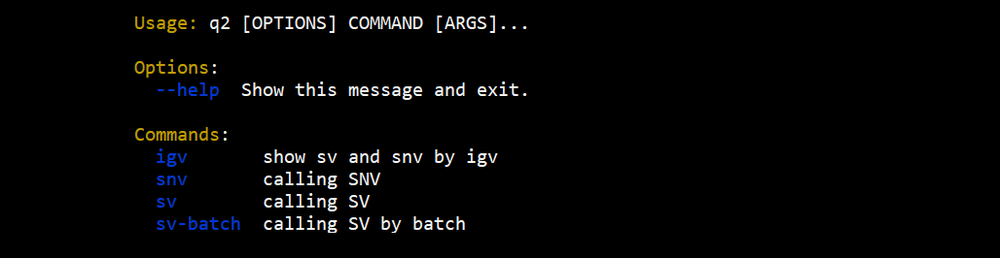
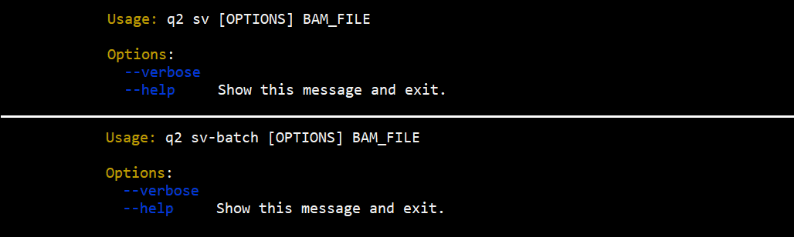
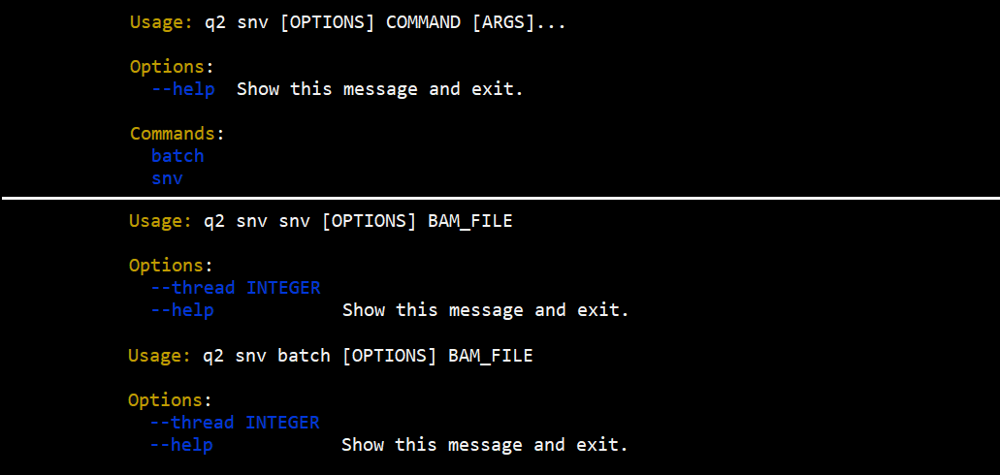

# Plugins-based Framework

大致学习了[qiime2](https://github.com/qiime2/qiime2)的基于插件的框架，在这里模拟一个demo。

以下是涉及到的4个包：

* q2：框架管理器
* q2-sv：结构变异calling插件
* q2-snv: 点突变calling插件
* q2-igv: 画图插件

4个包通过"pip isntall ."安装，也可以通过"pip install -e ."来预安装，方便调试。

下面展示各个接口：

​	**q2**

**q2 sv/sv-batch**

**q2 snv**

**q2 igv**

**sv**, **snv**, **igv **三个插件包通过'Q2.plugins'入口组进行统一管理。

## other

click给出了一个基于本地plugins的方法，也可以借鉴：[click/examples/complex at main · pallets/click (github.com)](https://github.com/pallets/click/tree/main/examples/complex)

